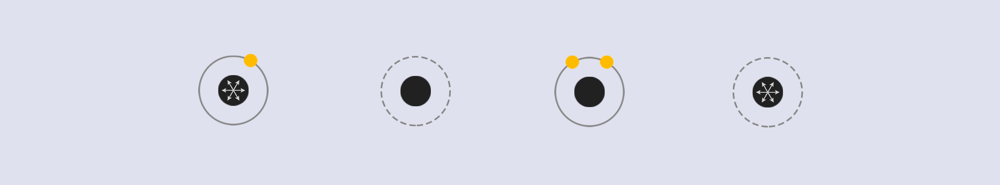

# ChainReaction
A puzzle game made with Unity. You can play online or download the game on [itch.io](https://ggross.itch.io/chain-reaction)
## How to play
* Click the nuclei to activate an atom and release all the neutrons. When a free neutron touches another atom's nuclei, the CHAIN REACTION will happen.  
* Clear all the atoms within limited clicks!
## Game content
* Atoms with different mechanisms
  
* Have fun in 40 levels
  
## Acknowledgement
* The game concept is inspired by [Quantum Splitter by OlivierGuillaume](https://olivierguillaume.itch.io/quantum-splitter).  
* The BGM is Le tombeau de Couperin, composed by Ravel, performed by Angela Hewitt.  
